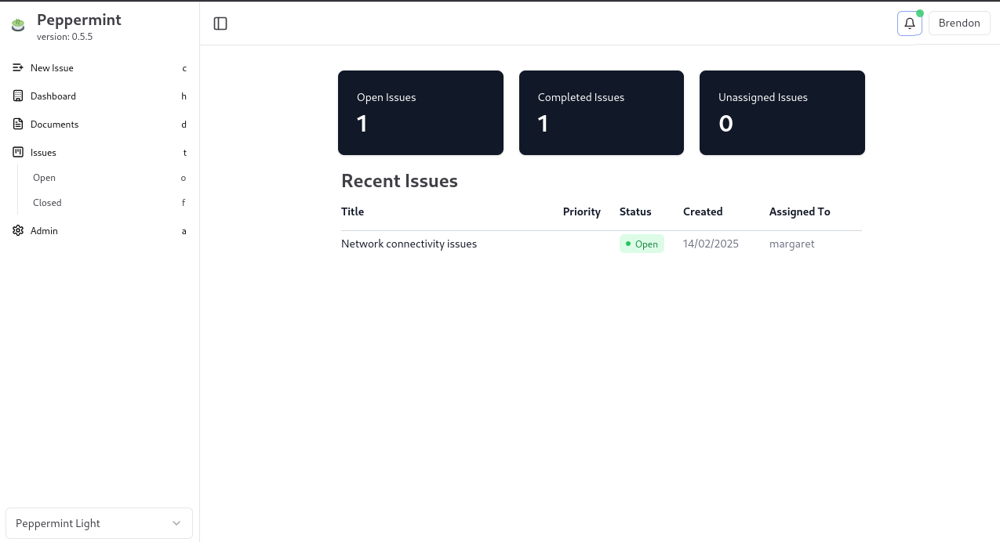
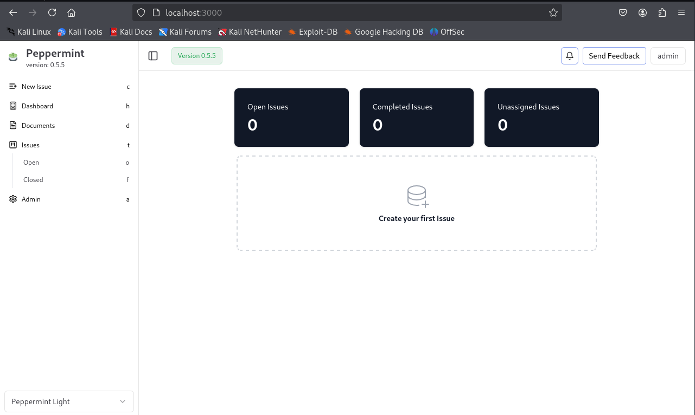

Peppermint Ticketing System - Dockerized Version

Overview

Peppermint Ticketing System is an open-source support ticket management system designed for seamless issue tracking and resolution. This repository contains a Dockerized setup for easy deployment and scalability.

Features

Ticket creation and assignment

Role-based access control (Admin, Support, User)

Real-time status updates

User-friendly dashboard

Email notifications

API support for integration

Prerequisites

Ensure you have the following installed:

Docker

Docker Compose

### Dashboard Screenshot

### First Ticket Screenshot

### Closed Ticket Screenshot

### Ticket Priority Screenshot

### Clients Screenshot

### Logs Screenshot

### Users Screenshot

### Additional Screenshot

Installation & Setup

Step 1: Clone the Repository

git clone https://github.com/your-repo/peppermint-ticketing-docker.git
cd peppermint-ticketing-docker

Step 2: Build and Run the Docker Containers

docker-compose up -d --build

This command will:

Build the necessary Docker images

Start the application along with its dependencies

Step 3: Access the Application

Once the containers are running, access the system via:

http://localhost:8000

(Default port may vary based on configuration)

Configuration

Modify the .env file to adjust environment settings, such as database credentials and email configurations.

Docker Management

Stop the containers:

docker-compose down

Restart the containers:

docker-compose up -d

View logs:

docker-compose logs -f

Contributing

We welcome contributions! Feel free to fork this repository and submit pull requests.

License

This project is licensed under the MIT License.

Acknowledgments

Special thanks to the Peppermint Ticketing System community and the Docker contributors for their work in making deployment easier!

